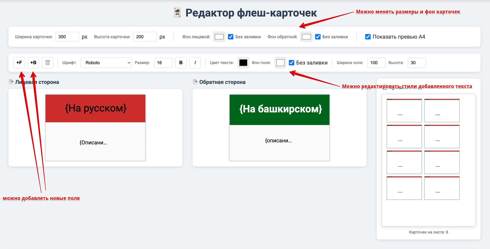
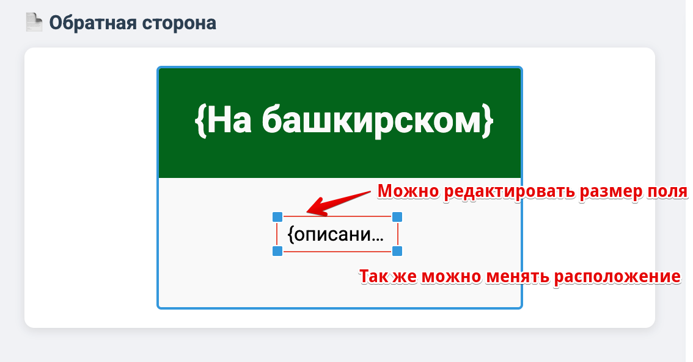
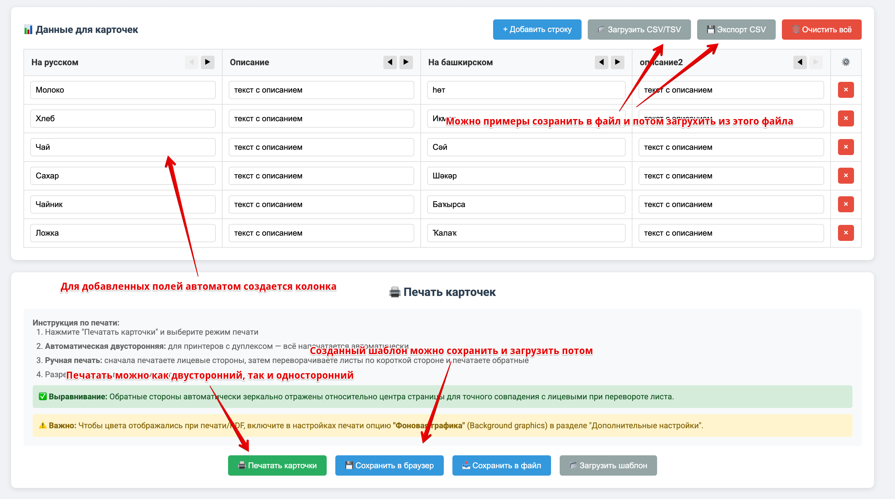
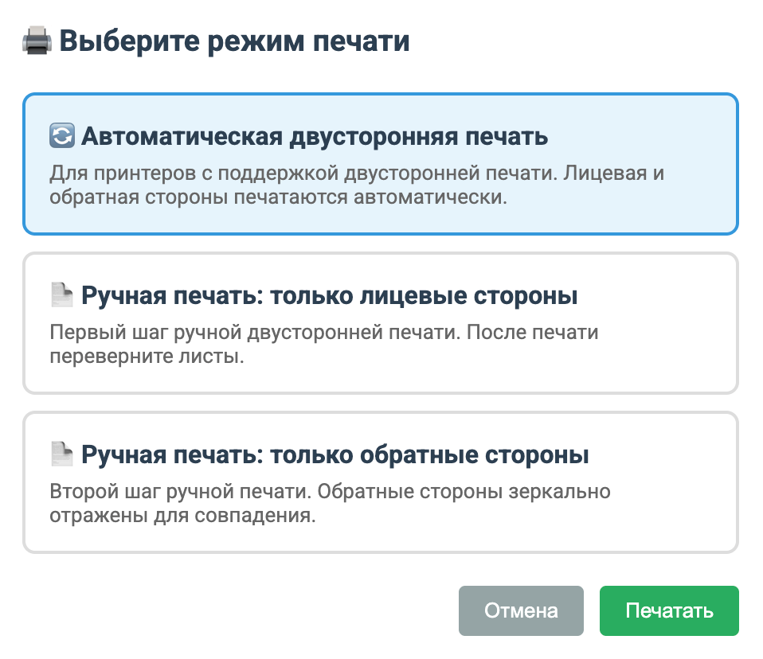

# 🃏 Редактор флеш-карточек

Простой и удобный инструмент для создания и печати флеш-карточек для изучения языков, терминов и любой другой информации.

## 🚀 Попробовать онлайн

**[Открыть редактор](https://htmlpreview.github.io/?https://github.com/kod-odin/flashcard-editor/blob/main/flashcard-editor.html)**

> Альтернативная ссылка: [raw.githack.com](https://raw.githack.com/kod-odin/flashcard-editor/main/flashcard-editor.html)

Или скачайте `flashcard-editor.html` и откройте локально в браузере — интернет не требуется.

---

## ✨ Возможности

- 📝 Создание произвольных текстовых полей на лицевой и обратной стороне карточки
- 🎨 Настройка шрифта, размера, цвета, фона для каждого поля
- 📐 Изменение размеров карточек и полей
- 📊 Автоматическое создание таблицы для ввода данных
- 📁 Импорт/экспорт данных в CSV/TSV
- 💾 Сохранение и загрузка шаблонов
- 🖨️ Печать с поддержкой двусторонней печати
- 📋 Превью размещения карточек на листе А4

---

## 📖 Как пользоваться

### 1. Настройка шаблона карточки

Начните с настройки размеров карточки и добавления текстовых полей:



- **Размеры карточки** — задайте ширину и высоту в пикселях
- **Фон карточек** — выберите цвет фона для лицевой и обратной стороны
- **Кнопка +F** — добавить поле на лицевую сторону
- **Кнопка +B** — добавить поле на обратную сторону
- **Превью А4** — показывает сколько карточек поместится на листе

### 2. Редактирование полей

Каждое поле можно настроить индивидуально:



- **Перетаскивание** — зажмите поле и переместите в нужное место
- **Изменение размера** — потяните за угловые маркеры
- **Стили текста** — выберите шрифт, размер, цвет, жирность в панели инструментов
- **Фон поля** — можно задать цвет фона или оставить прозрачным

### 3. Заполнение данных

После добавления полей автоматически создаётся таблица для ввода данных:



- **Добавить строку** — создаёт новую карточку
- **Загрузить CSV/TSV** — импорт данных из файла
- **Экспорт CSV** — сохранение данных в файл
- **Стрелки ◀ ▶** — изменение порядка колонок
- **Сохранить в файл** — сохраняет шаблон + данные в JSON

### 4. Печать карточек

Выберите режим печати в зависимости от возможностей вашего принтера:



| Режим | Описание |
|-------|----------|
| **Автоматическая двусторонняя** | Для принтеров с дуплексом — всё печатается автоматически |
| **Ручная: лицевые стороны** | Первый шаг — печать лицевых сторон |
| **Ручная: обратные стороны** | Второй шаг — переверните листы и напечатайте обратные |

> ⚠️ **Важно:** Включите опцию "Фоновая графика" (Background graphics) в настройках печати браузера, чтобы цвета отображались корректно.

---

## 💡 Примеры использования

### Изучение языков
- **Лицевая сторона:** слово на родном языке
- **Обратная сторона:** перевод, транскрипция, пример использования

### Подготовка к экзаменам
- **Лицевая сторона:** вопрос или термин
- **Обратная сторона:** ответ или определение

### Запоминание формул
- **Лицевая сторона:** название формулы
- **Обратная сторона:** сама формула и пояснение

---

## 🔧 Технические детали

- Работает полностью в браузере (HTML + JavaScript)
- Не требует сервера или интернета (можно использовать локально)
- Данные сохраняются в localStorage браузера или в JSON-файл
- Поддерживаемые браузеры: Chrome, Firefox, Safari, Edge

---

## 📝 Формат CSV/TSV для импорта

Первая строка — заголовки (названия полей), остальные — данные:

```csv
На русском,На башкирском,Описание
Молоко,Һөт,напиток
Хлеб,Икмәк,еда
Чай,Сәй,напиток
```

---

## 📄 Лицензия

MIT License — используйте свободно.

---

## 🤝 Вклад в проект

Нашли баг или есть идея? Создайте [Issue](https://github.com/kod-odin/flashcard-editor/issues) или отправьте Pull Request!
